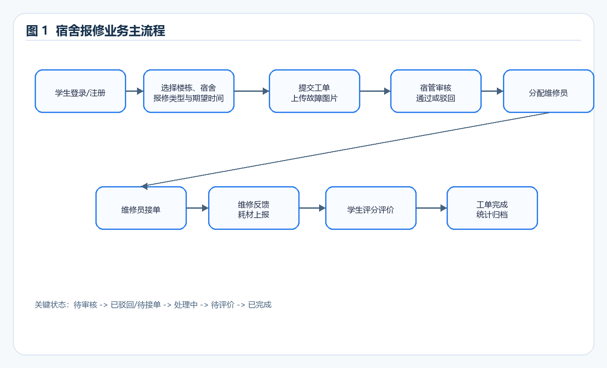
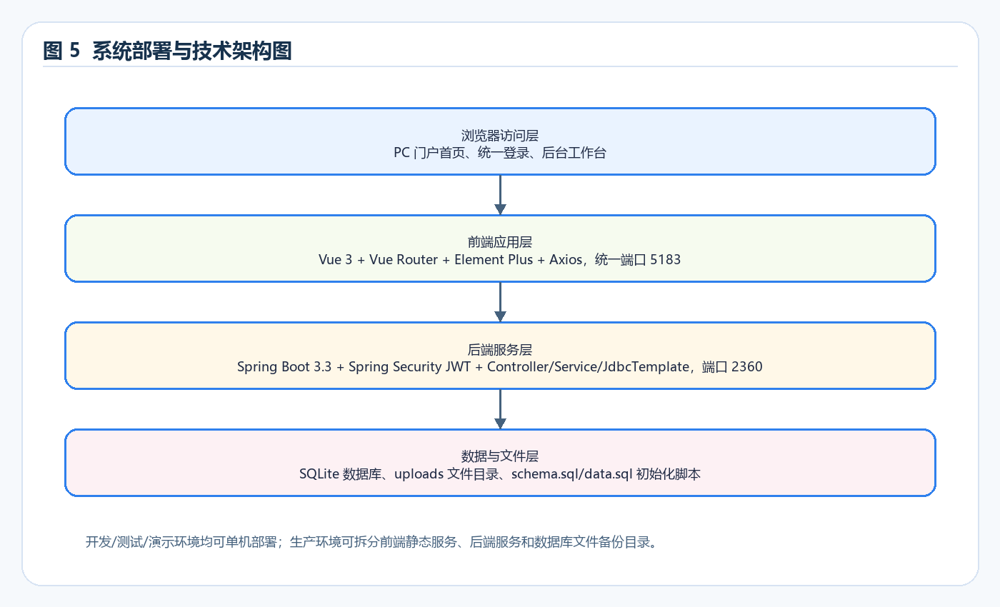
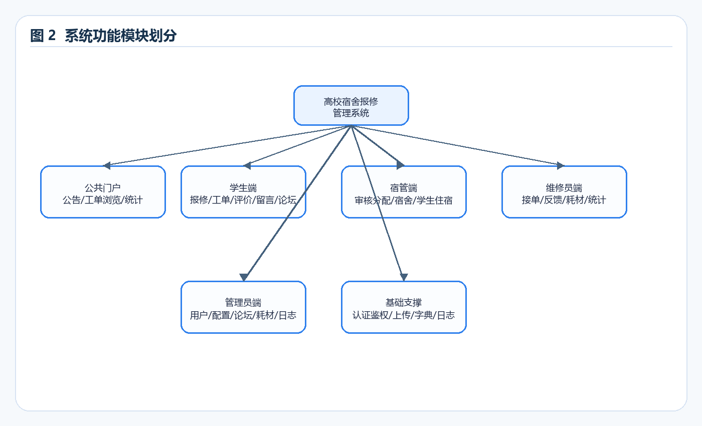
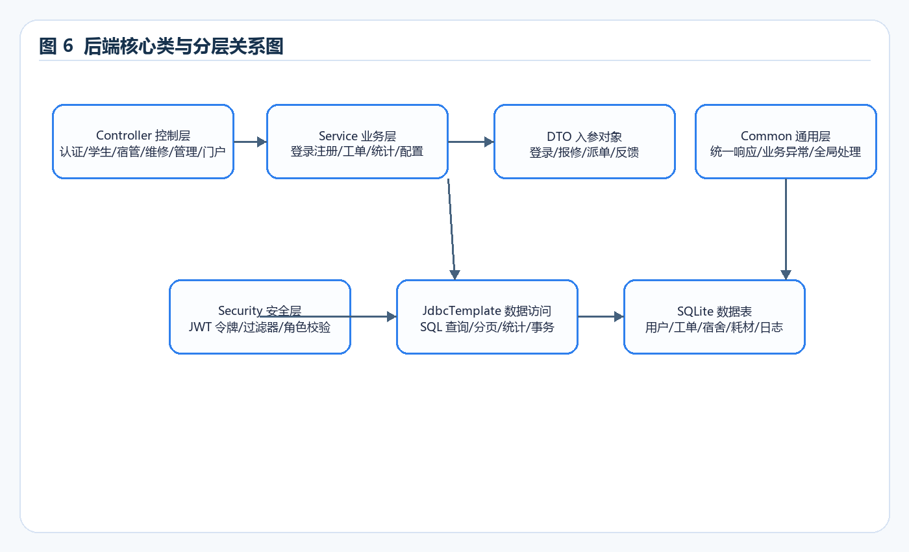
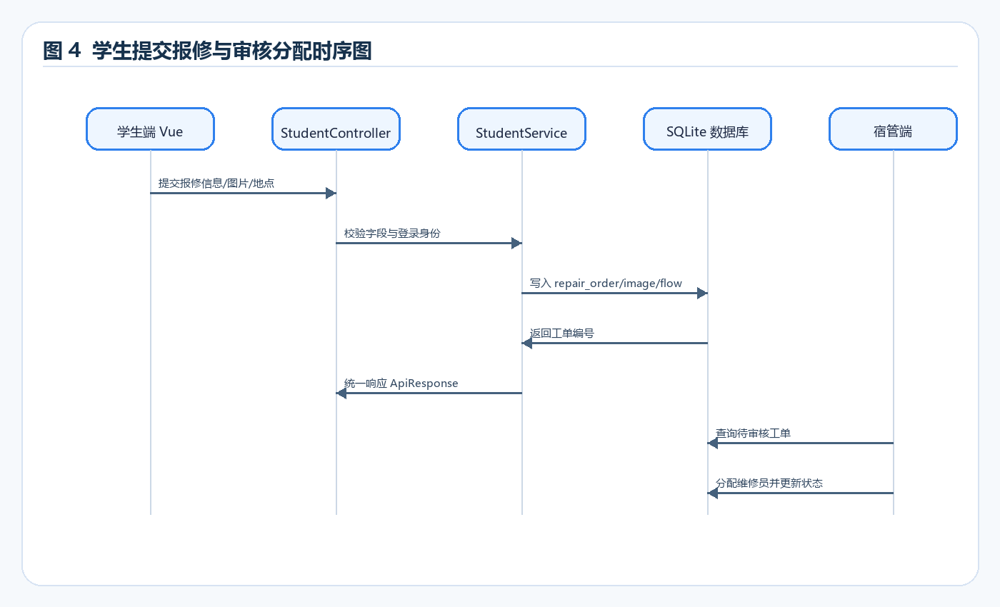
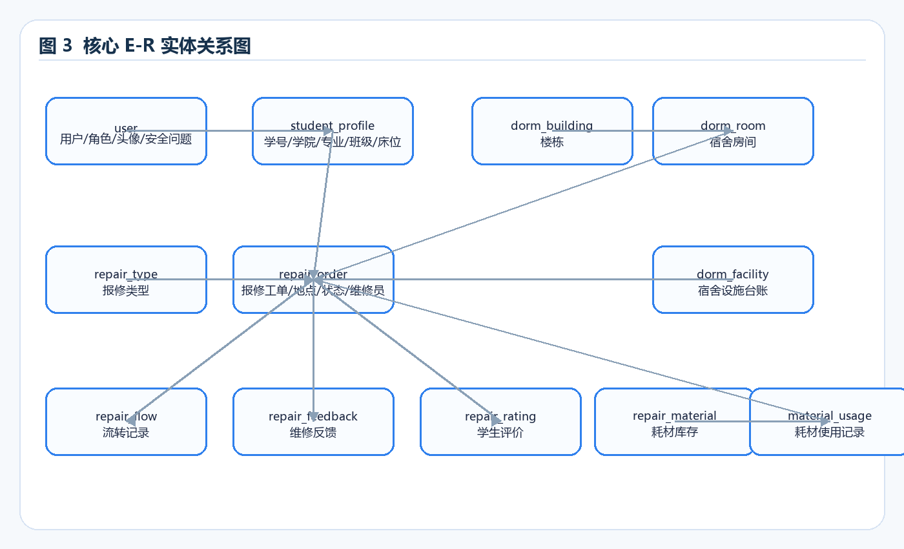
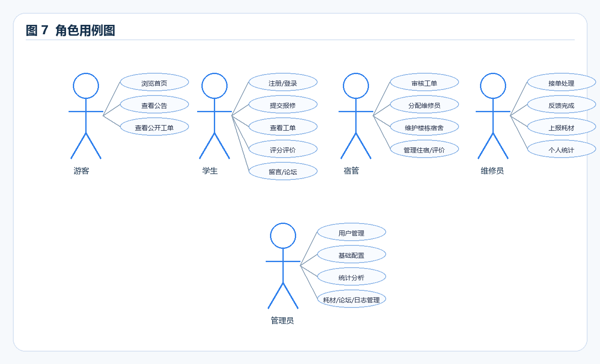

# 高校宿舍报修管理系统项目文档

    > 文档版本：V1.0  
    > 生成日期：2026-05-09  
    > 适用项目：`C:\Coding\260324_Dormitory-Repair-Management`  
    > 说明：本文档中的图例参考附件示例的表达方式，但已按本项目实际业务、技术架构和数据库实体重新绘制。
    
    ## 一、项目概述
    
    ### 1. 项目背景与业务现状
    
    高校宿舍日常运行中，水电、门窗、家具、网络、公共设施等故障具有高频、分散、时效要求高的特点。传统报修方式通常依赖电话、纸质登记、微信群或线下口头反馈，容易出现报修记录不完整、处理进度不透明、维修责任难追踪、满意度难统计、耗材消耗无台账等问题。宿管人员需要在大量信息中进行人工筛选和分派，维修人员缺少统一的接单与反馈入口，管理员也难以及时掌握服务质量、楼栋故障热点和库存耗材变化。
    
    本项目以“高校宿舍报修管理系统”为建设对象，围绕学生报修、宿管审核派单、维修员处理反馈、学生评价、管理员统计配置等核心流程，构建统一门户和后台工作台。系统支持游客浏览首页公告和公开工单，学生登录后提交报修、发帖留言、评价维修服务；宿管负责工单审核、楼栋宿舍、学生住宿和评价管理；维修员负责接单、反馈、耗材上报和个人统计；管理员负责用户、基础配置、耗材、论坛、留言、公告、日志与统计分析。
    
    ### 2. 项目目标、核心价值与建设意义
    
    项目目标是建设一个可演示、可维护、可扩展的宿舍报修业务系统，使报修流程从“人工通知”转为“线上闭环”。系统核心价值包括：提升学生报修便利性，提升宿管派单效率，提升维修人员处理可追踪性，沉淀服务评价和统计数据，支撑楼栋热点分析和耗材库存管理。对毕业设计而言，系统覆盖前后端分离、角色权限、文件上传、分页查询、统计分析、数据库设计和业务流程闭环，能够体现较完整的软件工程实践。
    
    ### 3. 整体业务流程简要说明
    
    学生进入统一门户，登录后在报修页面选择楼栋、宿舍、可选设施、报修类型、期望维修时间，填写故障描述并上传图片。工单提交后进入待审核状态，宿管审核通过后分配维修员，也可因信息不完整驳回。维修员接单后进入处理中，完成维修时填写处理结果、上传结果图片并上报耗材使用量，系统同步扣减耗材库存。学生确认服务后进行 1-5 星评分与文字评价，工单最终归档为已完成。系统在首页和后台统计中心展示工单数量、完成率、满意度、楼栋工单数量排行等数据。
    
    
    
    ### 4. 术语定义、缩略词、参考文档
    
    | 术语 | 说明 |
    | --- | --- |
    | 报修工单 | 学生提交的宿舍故障处理请求，是系统核心业务对象。 |
    | 宿管 | 宿舍管理员，负责审核工单、维护宿舍与学生住宿信息。 |
    | 维修员 | 负责接单、处理工单、反馈维修结果和上报耗材。 |
    | 耗材 | 维修过程中消耗的材料，如灯管、插座、阀门等。 |
    | 统一门户 | 所有角色访问系统的公共首页，提供公告、统计、登录入口和业务入口。 |
    | JWT | JSON Web Token，用于前后端分离场景下的登录态认证。 |
    
    参考文档包括项目 `README.md`、`PROJECT_SUMMARY.md`、`schema.sql`、`data.sql`、前端路由文件以及各 Controller/Service 源码。
    
    ## 二、需求分析
    
    ### 1. 功能性需求
    
    系统面向游客、学生、宿管、维修员和管理员五类使用者。游客可访问统一首页、浏览公告和公开工单详情。学生可注册登录、找回密码、提交报修、查看我的工单、评价维修服务、维护个人信息和头像、提交服务留言、参与论坛发帖评论、查看维修员信息。宿管可审核和分配工单、维护楼栋宿舍、设施台账、学生住宿和学生班级，管理公告、论坛、留言与评价。维修员可查看可处理工单、接单、完成反馈、上报耗材、查看个人统计、维护头像和多重维修类型。管理员可进行统计分析、用户管理、基础配置、报修类型、学院专业班级、耗材管理、公告论坛留言评价管理和系统日志查询。
    
    ### 2. 非功能性需求
    
    系统应满足常规校园宿舍场景的响应速度要求。工单、设施、留言、论坛、用户等列表应分页展示，工单相关查询由后端分页实现，避免数据量增长后影响响应速度。安全方面采用 JWT 登录认证和角色权限控制，限制不同角色访问范围。兼容性方面，前端以 PC 演示为主，同时提供响应式布局以适配手机浏览。可扩展性方面，系统采用 Controller/Service/DTO 分层和统一数据字典，便于扩展新的工单状态、报修类型和维修工种。易用性方面，页面采用统一门户、卡片化布局、中文状态、图片预览、弹窗表单和清晰的错误提示。运维方面，系统采用单体后端、单前端、SQLite 数据库和本地上传目录，便于毕业设计部署与演示。
    
    ### 3. 约束条件
    
    技术栈约束为 Vue 3 + Element Plus + Spring Boot + SQLite，保持前后端分离和单体架构，不引入 Redis、消息队列、MinIO、微服务网关等重型组件。运行环境要求 Java 17、Maven、Node.js 和 npm。数据库采用 SQLite，适合单机演示和小规模部署。工期和成本约束要求以最小可交付为前提逐步增强成品感，因此在满足核心流程的同时，优先实现与宿舍报修直接相关的模块。
    
    ### 4. 业务边界、不包含内容说明
    
    系统不包含短信或邮箱验证码，不实现线上支付、复杂审批流引擎、物业合同管理、仓库采购审批、匿名论坛、即时聊天、复杂推荐算法和微服务分布式部署。已删除报修知识模块，避免系统主题发散。论坛用于公开交流但浏览、发帖和评论需要登录，评论展示头像、用户名和评论时间。
    
    ## 三、总体架构设计
    
    ### 1. 整体架构方案
    
    系统采用前后端分离的单体架构。前端统一为 `admin-web` 一个 Vue 3 应用，承载公共门户、学生端页面和后台工作台；后端为 `server` Spring Boot 应用，提供 RESTful API、JWT 鉴权、业务服务、文件访问和数据库操作；数据库采用 SQLite，通过 `schema.sql` 和 `data.sql` 初始化表结构与演示数据。
    
    
    
    ### 2. 架构拓扑图、系统模块划分
    
    系统按访问层、前端应用层、后端服务层、数据与文件层划分。模块上包括公共门户、学生模块、宿管模块、维修员模块、管理员模块和基础支撑模块。
    
    
    
    ### 3. 技术栈选型
    
    | 层级 | 技术 | 选型说明 |
    | --- | --- | --- |
    | 前端 | Vue 3、Vue Router、Element Plus、Axios | 适合构建 PC 门户和后台管理页面，组件成熟，便于快速开发。 |
    | 后端 | Spring Boot 3.3.12、Spring Security、JdbcTemplate | 单体架构清晰，安全与接口能力完整，SQL 可控。 |
    | 数据库 | SQLite | 部署简单，适合毕业设计演示和单机运行。 |
    | 文件 | 本地 uploads 目录 | 支持头像、公告图、工单图、留言图上传与访问。 |
    | 构建 | Maven、npm/Vite | 分别负责后端和前端构建运行。 |
    
    ### 4. 部署架构、环境划分
    
    开发环境在本机启动后端 `2360` 端口和统一前端 `5183` 端口。测试环境可使用同样的单机部署方式，配合独立数据库文件和上传目录。生产环境如需上线，可将前端构建产物部署到 Nginx，后端以 Jar 方式运行，并定期备份 SQLite 数据库和 uploads 目录。
    
    ## 四、详细模块设计
    
    ### 1. 各功能模块拆分与职责说明
    
    | 模块 | 子功能 | 职责说明 |
    | --- | --- | --- |
    | 公共门户 | 首页、公告、公开工单详情、登录入口 | 展示系统能力、服务统计、楼栋工单排行和公告信息。 |
    | 学生模块 | 注册登录、报修、我的工单、评价、留言、论坛、个人中心 | 完成学生从报修到评价的闭环，并支持服务反馈和社区交流。 |
    | 宿管模块 | 工单审核、派单、楼栋宿舍、设施、住宿、班级 | 负责宿舍管理和工单前置审核分配。 |
    | 维修员模块 | 接单、反馈、耗材、统计、个人信息 | 负责工单处理过程和维修结果沉淀。 |
    | 管理员模块 | 统计、用户、配置、耗材、公告、论坛、留言、评价、日志 | 负责系统级配置、数据治理和运营分析。 |
    | 基础支撑 | JWT、统一响应、异常处理、上传、日志 | 为业务模块提供通用能力。 |
    
    ### 2. 模块间调用关系、交互逻辑
    
    前端页面通过 Axios 调用后端 REST API，登录成功后保存 JWT Token。路由守卫根据角色控制访问范围。后端 Controller 接收请求后调用 Service，Service 通过 JdbcTemplate 操作 SQLite。工单状态变化时，系统同时写入 `repair_flow` 流转记录；关键操作写入 `sys_log`；维修完成上报耗材时更新 `material_usage` 并扣减 `repair_material.stock_qty`。
    
    
    
    ### 3. 核心业务流程详细流程图
    
    核心流程包括：学生提交报修、宿管审核分配、维修员接单处理、维修反馈与耗材上报、学生评价归档。接口调用时序如下：
    
    
    
    ### 4. 关键逻辑规则、业务算法说明
    
    工单状态以中文展示，后端内部状态用于流程判断。未审核工单由宿管审核，驳回后记录驳回原因；审核通过必须分配维修员；维修员接单后才计入个人已接单完成率；完成率计算口径为已接单工单中已完成数量占比。平均处理时长以 `assigned_at` 到 `completed_at` 的小时差计算。耗材上报时要求库存足够，提交成功后扣减库存。评价为 1-5 星，一个工单只能评价一次；管理员或宿管可删除恶意评价，删除不影响工单完成状态，但评价不再展示。报修类型删除时，如果存在未完成工单引用该类型，则禁止删除。手机号注册和修改时前端校验为 11 位。
    
    ## 五、数据库设计
    
    ### 1. 数据库选型与存储方案
    
    项目采用 SQLite 数据库。该方案无需单独安装数据库服务，适合毕业设计和客户本地演示。数据初始化由 Spring Boot 执行 `schema.sql` 和 `data.sql`，上传文件保存在项目根目录 `uploads` 下，数据库中保存文件路径。
    
    ### 2. E-R 实体关系图
    
    
    
    ### 3. 数据表详细设计
    
    #### user：系统用户表

| 字段名                   | 类型      | 约束         | 说明                                |
| --------------------- | ------- | ---------- | --------------------------------- |
| id                    | INTEGER | 主键，自增      | 用户唯一编号                            |
| username              | TEXT    | 唯一、非空      | 登录用户名                             |
| password              | TEXT    | 非空         | 登录密码，沿用项目现有明文存储方式                 |
| real_name             | TEXT    | 非空         | 真实姓名                              |
| phone                 | TEXT    | 可空         | 联系电话，前端校验 11 位                    |
| avatar                | TEXT    | 可空         | 头像文件路径                            |
| role                  | TEXT    | 非空         | student、dorm_admin、repairer、admin |
| work_type_code        | TEXT    | 可空         | 维修员工种，支持多工种编码                     |
| password_question     | TEXT    | 可空         | 非管理员找回密码问题                        |
| password_answer       | TEXT    | 可空         | 非管理员找回密码答案                        |
| status                | TEXT    | 默认 enabled | 账号状态                              |
| created_at/updated_at | TEXT    | 非空         | 创建与更新时间                           |

#### dorm_building：宿舍楼栋表

| 字段名           | 类型      | 约束   | 说明     |
| ------------- | ------- | ---- | ------ |
| id            | INTEGER | 主键   | 楼栋编号   |
| building_name | TEXT    | 非空   | 楼栋名称   |
| building_code | TEXT    | 唯一   | 楼栋编码   |
| gender_type   | TEXT    | 可空   | 入住性别类型 |
| floor_count   | INTEGER | 默认 0 | 楼层数    |
| remark        | TEXT    | 可空   | 备注     |

#### dorm_room：宿舍房间表

| 字段名                    | 类型      | 约束         | 说明      |
| ---------------------- | ------- | ---------- | ------- |
| id                     | INTEGER | 主键         | 房间编号    |
| building_id            | INTEGER | 外键         | 所属楼栋    |
| room_no                | TEXT    | 非空         | 宿舍号     |
| capacity/current_count | INTEGER | 默认 0       | 容量与当前人数 |
| facility_desc          | TEXT    | 可空         | 房间设施摘要  |
| status                 | TEXT    | 默认 enabled | 房间状态    |
| remark                 | TEXT    | 可空         | 备注      |

#### dorm_facility：宿舍设施台账表

| 字段名                         | 类型      | 约束        | 说明      |
| --------------------------- | ------- | --------- | ------- |
| id                          | INTEGER | 主键        | 设施编号    |
| room_id                     | INTEGER | 外键        | 所属宿舍    |
| facility_name/facility_type | TEXT    | 非空        | 设施名称与类型 |
| brand/model_number          | TEXT    | 可空        | 品牌与型号   |
| purchase_date               | TEXT    | 可空        | 采购日期    |
| status                      | TEXT    | 默认 normal | 设施状态    |
| remark                      | TEXT    | 可空        | 备注      |
| created_at/updated_at       | TEXT    | 非空        | 创建与更新时间 |

#### student_profile：学生档案表

| 字段名                      | 类型      | 约束   | 说明       |
| ------------------------ | ------- | ---- | -------- |
| id                       | INTEGER | 主键   | 档案编号     |
| user_id                  | INTEGER | 唯一外键 | 关联用户     |
| student_no               | TEXT    | 唯一   | 学号       |
| gender                   | TEXT    | 可空   | 性别       |
| college/major/class_name | TEXT    | 可空   | 学院、专业、班级 |
| building_id/room_id      | INTEGER | 外键   | 住宿楼栋与宿舍  |
| bed_no                   | TEXT    | 可空   | 床位号      |
| created_at/updated_at    | TEXT    | 非空   | 创建与更新时间  |

#### school_college/school_major/school_class：学院专业班级表

| 字段名                                | 类型      | 约束         | 说明            |
| ---------------------------------- | ------- | ---------- | ------------- |
| id                                 | INTEGER | 主键         | 基础数据编号        |
| college_id/major_id                | INTEGER | 外键         | 专业归属学院，班级归属专业 |
| college_name/major_name/class_name | TEXT    | 唯一约束       | 学院、专业、班级名称    |
| sort_no                            | INTEGER | 默认 0       | 排序号           |
| status                             | TEXT    | 默认 enabled | 启用状态          |
| created_at/updated_at              | TEXT    | 非空         | 创建与更新时间       |

#### repair_type：报修类型表

| 字段名       | 类型      | 约束         | 说明           |
| --------- | ------- | ---------- | ------------ |
| id        | INTEGER | 主键         | 类型编号         |
| type_name | TEXT    | 唯一         | 报修类型名称       |
| sort_no   | INTEGER | 唯一         | 排序号，新增时不允许重复 |
| status    | TEXT    | 默认 enabled | 启用状态         |

#### repair_order：报修工单主表

| 字段名                                   | 类型           | 约束    | 说明            |
| ------------------------------------- | ------------ | ----- | ------------- |
| id/order_no                           | INTEGER/TEXT | 主键/唯一 | 工单编号          |
| student_id                            | INTEGER      | 外键    | 提交学生          |
| building_id/room_id/facility_id       | INTEGER      | 外键，可空 | 提交时选择的维修地点与设施 |
| repair_type_id                        | INTEGER      | 外键    | 报修类型          |
| title/description                     | TEXT         | 非空    | 标题与故障描述       |
| expect_time                           | TEXT         | 可空    | 期望维修时间        |
| status                                | TEXT         | 非空    | 工单状态          |
| reject_reason                         | TEXT         | 可空    | 驳回原因          |
| assigned_repairer_id                  | INTEGER      | 外键，可空 | 分配维修员         |
| submitted_at/assigned_at/completed_at | TEXT         | 可空    | 提交、派单、完成时间    |
| created_at/updated_at                 | TEXT         | 非空    | 创建与更新时间       |

#### repair_order_image：工单图片表

| 字段名             | 类型      | 约束  | 说明          |
| --------------- | ------- | --- | ----------- |
| id              | INTEGER | 主键  | 图片编号        |
| repair_order_id | INTEGER | 外键  | 所属工单        |
| image_type      | TEXT    | 非空  | 报修图片或维修结果图片 |
| file_path       | TEXT    | 非空  | 图片文件路径      |
| created_at      | TEXT    | 非空  | 上传时间        |

#### repair_flow：工单流转表

| 字段名                   | 类型      | 约束    | 说明   |
| --------------------- | ------- | ----- | ---- |
| id                    | INTEGER | 主键    | 流转编号 |
| repair_order_id       | INTEGER | 外键    | 所属工单 |
| operator_id           | INTEGER | 外键    | 操作人  |
| from_status/to_status | TEXT    | 可空/非空 | 状态变化 |
| remark                | TEXT    | 可空    | 流转说明 |
| created_at            | TEXT    | 非空    | 操作时间 |

#### repair_feedback：维修反馈表

| 字段名             | 类型      | 约束   | 说明     |
| --------------- | ------- | ---- | ------ |
| id              | INTEGER | 主键   | 反馈编号   |
| repair_order_id | INTEGER | 唯一外键 | 所属工单   |
| repairer_id     | INTEGER | 外键   | 维修员    |
| result_desc     | TEXT    | 非空   | 处理结果说明 |
| materials_used  | TEXT    | 可空   | 耗材描述   |
| finish_time     | TEXT    | 非空   | 完成时间   |
| created_at      | TEXT    | 非空   | 反馈时间   |

#### repair_material/material_usage：耗材库存与使用表

| 字段名                              | 类型      | 约束   | 说明               |
| -------------------------------- | ------- | ---- | ---------------- |
| repair_material.id               | INTEGER | 主键   | 耗材编号             |
| material_name/material_type/unit | TEXT    | 名称唯一 | 耗材名称、分类、单位       |
| stock_qty/warning_qty            | REAL    | 默认 0 | 库存数量与预警数量        |
| material_usage.repair_order_id   | INTEGER | 外键   | 关联工单             |
| material_usage.quantity          | REAL    | 非空   | 本次使用数量，完成反馈时扣减库存 |
| created_at/updated_at            | TEXT    | 非空   | 时间字段             |

#### repair_rating：维修评价表

| 字段名             | 类型      | 约束   | 说明         |
| --------------- | ------- | ---- | ---------- |
| id              | INTEGER | 主键   | 评价编号       |
| repair_order_id | INTEGER | 唯一外键 | 一个工单只能评价一次 |
| student_id      | INTEGER | 外键   | 评价学生       |
| score           | INTEGER | 1-5  | 服务评分       |
| content         | TEXT    | 可空   | 评价内容       |
| created_at      | TEXT    | 非空   | 评价时间       |

#### announcement：公告表

| 字段名                     | 类型      | 约束           | 说明        |
| ----------------------- | ------- | ------------ | --------- |
| id                      | INTEGER | 主键           | 公告编号      |
| title/content           | TEXT    | 非空           | 公告标题与内容   |
| image_path              | TEXT    | 可空           | 公告配图      |
| publisher_id            | INTEGER | 外键           | 发布者       |
| status                  | TEXT    | 默认 published | 发布状态      |
| published_at/created_at | TEXT    | 可空/非空        | 发布时间与创建时间 |

#### forum_post/forum_comment：论坛帖子与评论表

| 字段名                      | 类型      | 约束           | 说明         |
| ------------------------ | ------- | ------------ | ---------- |
| forum_post.id            | INTEGER | 主键           | 帖子编号       |
| student_id               | INTEGER | 外键           | 发帖学生       |
| title/content/image_path | TEXT    | 内容字段         | 帖子标题、正文、配图 |
| status                   | TEXT    | 默认 published | 帖子状态       |
| forum_comment.user_id    | INTEGER | 外键           | 评论用户       |
| forum_comment.content    | TEXT    | 非空           | 评论内容       |
| created_at/updated_at    | TEXT    | 非空           | 发帖、评论时间    |

#### service_message：服务留言表

| 字段名                                 | 类型           | 约束         | 说明               |
| ----------------------------------- | ------------ | ---------- | ---------------- |
| id                                  | INTEGER      | 主键         | 留言编号             |
| student_id                          | INTEGER      | 外键         | 留言学生             |
| title/content/image_path            | TEXT         | 非空/可空      | 留言标题、内容、附图       |
| status                              | TEXT         | 默认 pending | 处理状态             |
| reply_content/replied_by/replied_at | TEXT/INTEGER | 可空         | 管理员回复内容、回复人、回复时间 |
| created_at/updated_at               | TEXT         | 非空         | 创建与更新时间          |

#### sys_log/sys_dict：系统日志与字典表

| 字段名                                       | 类型           | 约束    | 说明         |
| ----------------------------------------- | ------------ | ----- | ---------- |
| sys_log.user_id                           | INTEGER      | 外键，可空 | 操作用户       |
| module_name/operation_type/operation_desc | TEXT         | 非空    | 日志模块、类型、描述 |
| ip/created_at                             | TEXT         | 可空/非空 | 操作 IP 与时间  |
| sys_dict.dict_type/dict_code/dict_name    | TEXT         | 非空    | 字典类型、编码、名称 |
| sort_no/status                            | INTEGER/TEXT | 默认值   | 排序与启用状态    |

    ### 4. 索引设计、分表/缓存策略、数据字典
    
    系统已为用户角色、工单状态、学生工单、维修员工单、设施工单、工单流转、耗材使用、设施房间、服务留言、论坛帖子状态和论坛评论等字段建立索引。当前系统定位为单机演示与小规模使用，暂不进行分表和外部缓存。若后续工单量显著增长，可优先为 `repair_order.submitted_at`、`repair_order.building_id`、`repair_order.repair_type_id` 增加组合索引，并将图片文件迁移到对象存储。数据字典由 `sys_dict` 管理，包含维修工种、评价指标等配置；报修类型使用独立 `repair_type` 表作为业务主数据。
    
    ## 六、接口设计
    
    ### 1. 接口整体规范
    
    后端接口采用 REST 风格，统一前缀为 `/api`。请求格式主要为 JSON，图片上传使用 multipart/form-data。统一响应结构为 `ApiResponse`，字段包括 `code`、`message` 和 `data`；成功通常返回 `code=200`。需要登录的接口在请求头中携带 `Authorization: Bearer <token>`。接口异常由全局异常处理器转换为统一错误响应。
    
    ### 2. 前后端/第三方接口清单
    
    | 方法 | 接口地址 | 用途 | 主要入参 | 主要出参 |

| --- | --- | --- | --- | --- |
| POST | /api/auth/login | 统一登录 | username、password | token、userInfo、role |
| POST | /api/auth/register | 学生注册 | 账号、密码、学号、手机号、学院专业班级、安全问题 | 注册结果 |
| POST | /api/auth/forgot-password/question | 获取找回密码问题 | username | passwordQuestion |
| POST | /api/auth/forgot-password | 回答问题并重置密码 | username、answer、newPassword | 重置结果 |
| GET/PUT | /api/auth/security-question | 登录后维护安全问题 | question、answer | 保存结果 |
| GET | /api/portal/home | 门户首页数据 | 无 | 公告、公开工单、服务统计、楼栋排行 |
| GET | /api/portal/repair-orders/{id} | 游客查看公开工单详情 | id | 工单基础信息 |
| GET | /api/portal/announcements | 公开公告分页 | pageNum、pageSize | 公告分页列表 |
| GET | /api/student/forum-posts | 学生论坛列表 | keyword、pageNum、pageSize | 帖子分页列表 |
| POST | /api/student/forum-posts | 发布论坛帖子 | title、content、imagePath | 发布结果 |
| POST | /api/portal/forum-posts/{postId}/comments | 发表评论 | content | 评论结果 |
| POST | /api/student/repair-orders | 提交报修 | 楼栋、宿舍、设施、类型、标题、描述、期望时间、图片 | 创建结果 |
| GET | /api/student/repair-orders | 我的工单分页 | status、pageNum、pageSize | 工单列表 |
| GET | /api/student/repair-orders/{id} | 学生工单详情 | id | 工单、图片、流程、反馈、评价 |
| POST | /api/student/repair-orders/{id}/rating | 提交评价 | score、content | 评价结果 |
| POST | /api/student/service-messages | 提交服务留言 | title、content、imagePath | 留言结果 |
| GET | /api/dorm-admin/repair-orders | 宿管工单分页筛选 | status、pageNum、pageSize | 工单列表 |
| POST | /api/dorm-admin/repair-orders/query | 工单高级筛选 | 关键词、类型、状态、楼栋、维修员、时间范围 | 分页结果 |
| POST | /api/dorm-admin/repair-orders/{id}/assign | 审核并分配维修员 | repairerId、remark | 派单结果 |
| POST | /api/dorm-admin/repair-orders/{id}/reject | 驳回工单 | rejectReason | 驳回结果 |
| GET/POST/PUT/DELETE | /api/dorm-admin/buildings | 楼栋管理 | 楼栋信息 | 增删改查结果 |
| GET/POST/PUT/DELETE | /api/dorm-admin/rooms | 宿舍房间管理 | 房间信息 | 增删改查结果 |
| GET/POST/PUT/DELETE | /api/dorm-admin/facilities | 设施台账管理 | 设施信息 | 分页与增删改查结果 |
| POST | /api/repairer/repair-orders/{id}/accept | 维修员接单 | id | 接单结果 |
| POST | /api/repairer/repair-orders/{id}/feedback | 维修完成反馈与耗材上报 | resultDesc、materials、images | 完成结果 |
| GET | /api/repairer/statistics | 维修员个人统计 | dateFrom、dateTo | 完成率、平均处理时长等 |
| GET | /api/admin/statistics/overview | 管理员统计概览 | 时间范围 | 完成率、满意度、平均评分等 |
| GET | /api/admin/statistics/building-heat | 楼栋工单数量排行 | 时间范围 | 楼栋排行数据 |
| GET/POST/PUT/DELETE | /api/admin/users | 用户管理 | 用户信息、密码、安全问题 | 增删改查结果 |
| GET/POST/PUT/DELETE | /api/admin/materials | 耗材管理 | 耗材信息 | 库存维护结果 |
| GET/POST/PUT/DELETE | /api/admin/school-colleges|school-majors|school-classes | 学院专业班级管理 | 基础数据 | 增删改查结果 |

    ### 3. 核心接口详情
    
    #### 统一登录 `POST /api/auth/login`
    
    请求示例：
    
    ```json
    {
      "username": "student001",
      "password": "123456"
    }
    ```
    
    响应示例：
    
    ```json
    {
      "code": 200,
      "message": "success",
      "data": {
        "token": "jwt-token",
        "userInfo": {
          "id": 1,
          "username": "student001",
          "role": "student"
        }
      }
    }
    ```
    
    #### 提交报修 `POST /api/student/repair-orders`
    
    请求包含楼栋、宿舍、设施、报修类型、标题、描述、期望维修时间和图片路径。后端校验学生身份、报修类型和地点合法性后写入工单主表、图片表和流转表。
    
    #### 宿管分配维修员 `POST /api/dorm-admin/repair-orders/{id}/assign`
    
    请求包含维修员编号和备注。后端校验工单状态为待审核或待派单，更新 `assigned_repairer_id`、`assigned_at` 和状态，并写入流转记录。
    
    #### 维修反馈 `POST /api/repairer/repair-orders/{id}/feedback`
    
    请求包含处理结果、维修图片和耗材使用明细。后端校验维修员权限、工单状态和耗材库存，写入 `repair_feedback`、`material_usage`，并扣减 `repair_material.stock_qty`。
    
    ## 七、UI/交互设计
    
    ### 1. 页面结构、导航设计
    
    系统前端采用统一入口。公共层包含 `/home`、`/login`、`/announcements` 等页面。学生功能通过门户导航进入，包括我要报修、我的报修、公告信息、论坛交流、服务留言、维修员信息和个人中心。管理工作台通过左侧菜单组织，管理员、宿管、维修员根据角色看到不同菜单。
    
    
    
    ### 2. 关键页面原型/效果图
    
    首页采用宣传门户风格，包含系统 Banner、服务统计、楼栋工单数量排行、公告列表和公开工单列表。报修页面采用 PC 表单卡片布局，按报修地点、故障信息、图片上传、提交确认分组。后台页面采用左侧菜单和内容卡片布局，列表页包含筛选栏、分页、状态标签、详情弹窗和操作按钮。
    
    ### 3. 交互规则、弹窗、权限控制展示逻辑
    
    未登录访问受限页面时跳转登录页并携带 redirect 参数。登录页先选择角色，再输入账号密码；选择角色与实际账号角色不一致时拒绝登录。新增和编辑类操作尽量采用弹窗表单，避免页面跳转导致上下文丢失。图片预览支持点击图片或 ESC 关闭，避免遮挡文字。按钮、状态标签和下拉选项均使用中文，提升可读性。
    
    ## 八、安全设计
    
    ### 1. 身份认证、权限设计
    
    系统采用 Spring Security + JWT。后端登录成功后签发 Token，前端保存后在请求头携带。角色包括学生、宿管、维修员和管理员。前端路由守卫控制菜单和页面入口，后端通过 `SecurityUtils.requireRole` 等方式进行接口级权限校验，避免仅依赖前端控制。
    
    ### 2. 防 SQL 注入、XSS、CSRF、接口防刷
    
    后端通过 JdbcTemplate 参数绑定执行 SQL，避免字符串拼接造成 SQL 注入。前端对用户输入以文本方式展示，减少 XSS 风险。由于系统采用 JWT 无状态接口，CSRF 防护按前后端分离模式关闭，但受限接口需要 Authorization Token。接口防刷当前采用基础权限限制和表单校验，后续可加入限流拦截器。
    
    ### 3. 数据加密、敏感信息脱敏、日志审计
    
    当前项目沿用已有实现，密码和找回答案按普通字段存储，适合毕业设计演示但不建议直接用于生产。后续生产化应改为 BCrypt 哈希密码，并对找回答案加盐哈希。系统已提供 `sys_log` 记录关键操作，包括登录、工单处理、配置维护等，便于审计追踪。
    
    ## 九、性能与优化设计
    
    ### 1. 并发、负载、响应时间指标
    
    在单机演示环境下，目标是普通列表查询 1 秒内响应，工单提交与图片上传在网络正常情况下 3 秒内完成。系统主要面向宿舍维修管理的中低并发场景，不定位为高并发互联网系统。
    
    ### 2. 缓存方案、异步处理、定时任务设计
    
    当前版本未引入 Redis 缓存、消息队列和复杂定时任务。统计数据实时查询数据库，保证演示数据变化后立即可见。后续如数据量增长，可对首页统计、公告列表、字典配置等低频变化数据增加本地缓存或 Redis 缓存。
    
    ### 3. 大数据量/高并发场景优化策略
    
    工单相关列表采用后端分页，查询参数包括状态、类型、楼栋、维修员、关键词和时间范围，避免一次性返回大量数据。其他表格在数据量较小时可使用 Element Plus 前端分页；若后续规模扩大，应统一迁移到后端分页。数据库层已建立常用索引，后续可根据慢查询增加组合索引。图片文件不直接入库，只保存路径，减少数据库体积。
    
    ## 十、异常与容错设计
    
    ### 1. 全局异常捕获、错误处理机制
    
    后端通过 `GlobalExceptionHandler` 捕获业务异常和系统异常，统一转换为 `ApiResponse`。业务异常通过 `BusinessException` 明确提示，例如无权限、工单状态不允许操作、库存不足、报修类型被未完成工单引用等。前端统一拦截接口错误并弹出中文提示。
    
    ### 2. 重试机制、降级、熔断、兜底方案
    
    当前系统为单体本地部署，不引入分布式熔断。对于网络错误，前端提示用户稍后重试；对于图片上传失败，用户可重新上传；对于工单状态冲突，后端以业务异常返回，避免重复提交或越权操作。关键库存扣减应放在同一业务事务中，保证耗材使用和库存变化一致。
    
    ### 3. 日志收集、报错告警方案
    
    系统记录业务操作日志到 `sys_log`，后端运行日志由 Spring Boot 输出到控制台。演示环境可通过终端查看错误信息。生产化部署时建议增加文件日志滚动、异常邮件或企业微信告警，并定期备份 SQLite 数据库和上传目录。
